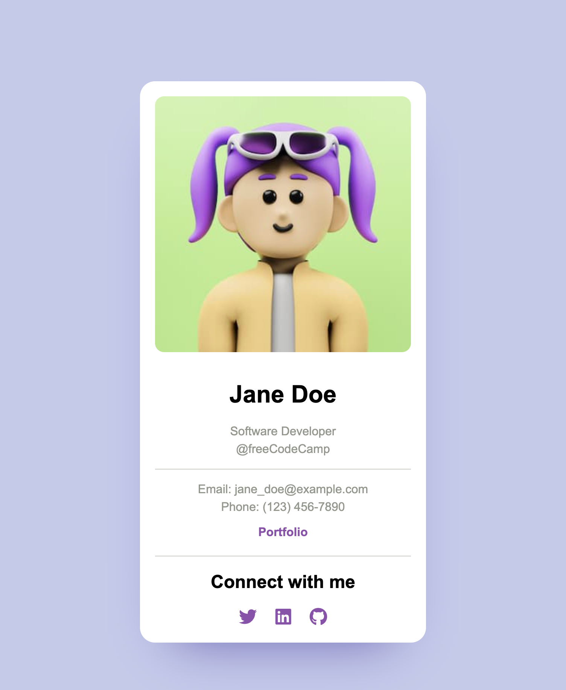

# Business Card

A responsive personal business card built with HTML and CSS, displaying a profile image, name, role, company, contact information, portfolio link, and social media icons. The card includes hover effects on links and icons and is centered on the page.

## Technologies Used

* **HTML5:** Semantic structure for profile image, name, designation, company, contact info, and social links.
* **CSS3:** Styling including colors, fonts, layout, and spacing. Key concepts:
    * Box model
    * CSS selectors
    * Text properties (fonts, alignment)
    * Margins and padding for spacing
    * Centering content using `margin: auto` and `text-align: center`

## Features

* **Clean Design:** Minimalist card layout with clear visual hierarchy.
* **Centered Layout:** Card horizontally centered on the page.
* **Contact Information:** Email, phone, and portfolio link.
* **Social Media Links:** Twitter, LinkedIn, GitHub icons with hover color effects.
* **Hover Effects:** Links and icons change color on hover.

## How to Run the Project

1. Clone the repository.
2. Navigate to the project directory.
3. Open `index.html` in a web browser.

## 📸 Preview

## 📄 License

This project is licensed under the [MIT License](https://opensource.org/licenses/MIT).
